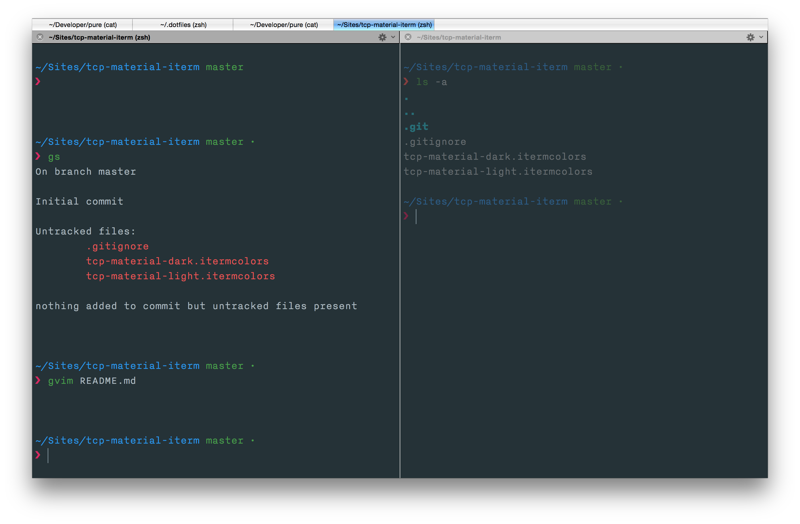
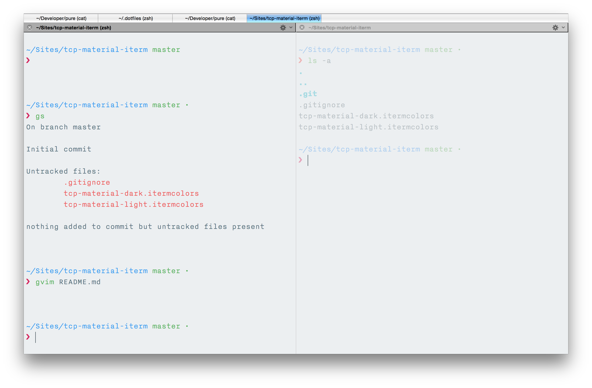

tcp-material-iterm
==================

Dark and light colour schemes for iTerm based on the [Material Design colour palette](http://www.google.com/design/spec/style/color.html#color-color-palette).

## Preview

### Dark:

### Light:

